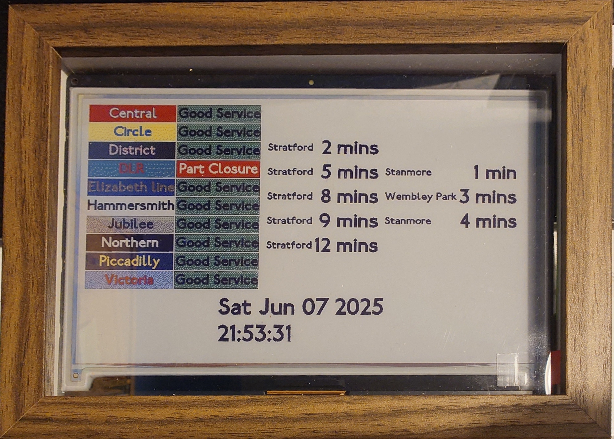

# InkyPi 

Fork of https://github.com/fatihak/InkyPi/ adding a TFL dashboard which fetches arrival times for trains for a given station using their public API. Also uses the `wkhtmltoimage` (QT WebKit) and not Chromium (Blink) engine as it doesn't run on a Raspberry Pi 0W.

## Example

## Build instructions:

- Source your own font and paste the .ttf file in `src/static/fonts/` and call it tflfont.ttf.
- Choose the station you want to fetch data for and set the `CHOSEN_LINE` and `CHOSEN_STATION` variables in the `src/plugins/tfl/tfl.py` file. Example given in the file.
- Follow the instructions in the main repo.
